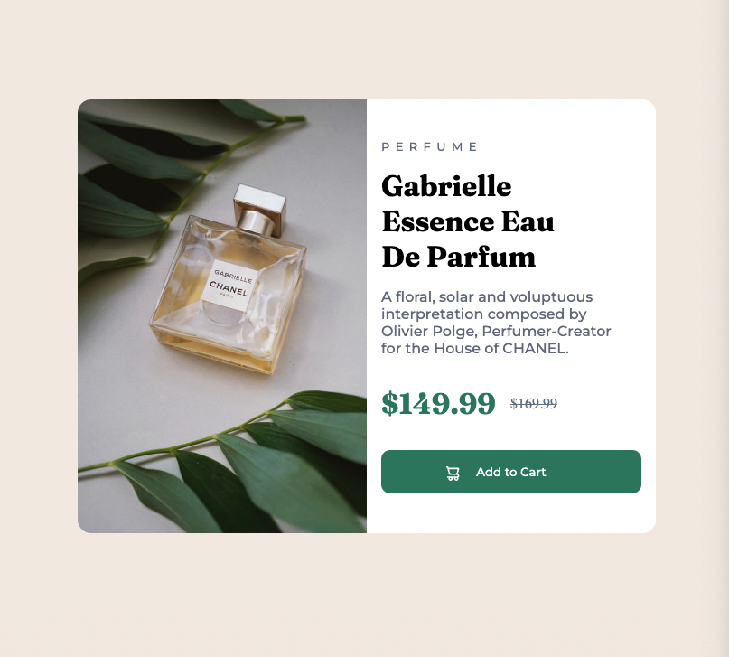
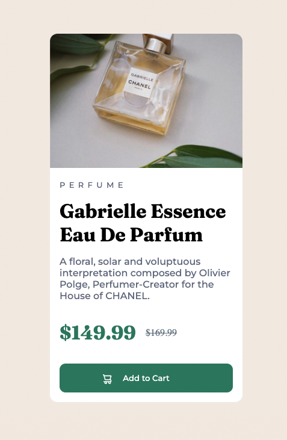

# Frontend Mentor - Product preview card component solution

This is a solution to the [Product preview card component challenge on Frontend Mentor](https://www.frontendmentor.io/challenges/product-preview-card-component-GO7UmttRfa). Frontend Mentor challenges help you improve your coding skills by building realistic projects. 

## Table of contents

- [Overview](#overview)
  - [The challenge](#the-challenge)
  - [Screenshot](#screenshot)
  - [Links](#links)
  - [My process](#my-process)
  - [Built with](#built-with)
  - [What I learned](#what-i-learned)
  - [Continued development](#continued-development)
  - [Useful resources](#useful-resources)
  - [Author](#author)
  - [Acknowledgments](#acknowledgments)


## Overview
I created this Frontend Mentor solution using a mobile first approach, Flexbox and media queries.  

### The challenge

Users should be able to:

- View the optimal layout depending on their    device's screen size(
  I set the media query to 700px. Making the breakpoint just bigger than the card. I would be greatful for some feedback on the layout based on other browser sizes.
)
- See hover on the add to cart button.

### Screenshot





### Links

- Solution URL: https://github.com/timbosTours/FEM-perfume-card
- Live Site URL: https://timbostours.github.io/FEM-perfume-card/

## My process
I went for a mobile first design. I tried to build a good HTML doc and add semantic HTML and ARIA where I thought necessary. I then worked on the layout before styling the colours and fonts. I used media queries and flex to make it responsive.  

### Built with

- Semantic HTML5 markup
- CSS custom properties
- Flexbox
- Mobile-first workflow

### What I learned

I learnt more about layout and flexbox and positioning different objects. I also learnt about aria-label and aria-hidden. I also enjoyed practicing media queries to make it responsive.


```html
<!-- Would like some feedback on the use of ARIA in this section -->
<h4 id="retail-price" aria-label="original price $169.99">$169.99</h4>
      </div>
      <button id="btn">
        
        <a id="addtocart" href="#">Add to Cart</a>
      </button>
    </div>
```
```css
/* I put the breakpoint at 700px as it was slightly wider than the 40rem container. */
@media (min-width: 700px) {
    .container{
        display: flex;
        min-width: 40rem;
        max-height: 30em;
        border-radius: 15px;
    }
    
    #mobile-img{
        display: none;
    }

    #desktop-img{
        display: flex;
    }
```

### Continued development

I look forward to practacing more flexbox and trying out grid as an alternative. I still need to get a better grasp on the box model but I had an easier time positioning objects on this project.


### Useful resources

- https://www.youtube.com/watch?v=N5wpD9Ov_To
  A great short video to check up on usiing the right size units.
- https://www.youtube.com/watch?v=3elGSZSWTbM&t=674s
  This video helped me to decide if I should use flexbox or grid.

## Author

- Website - https://github.com/timbosTours
- Frontend Mentor - [@timbosTours](https://www.frontendmentor.io/profile/timbosTours)
- Twitter - [@timbosTours](https://www.twitter.com/timbosTours)


## Acknowledgments

Thanks as always to the Frontend Mentor community. I would also like to thank Keven Powell for his great videos.

https://www.youtube.com/kepowob
